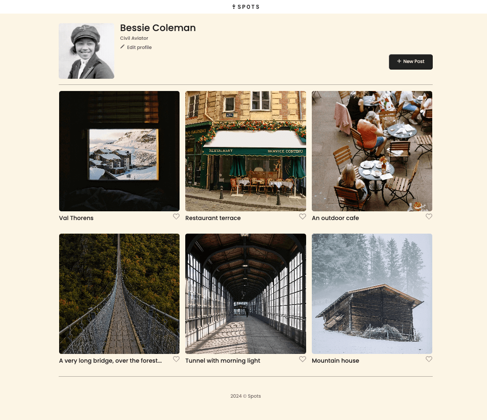
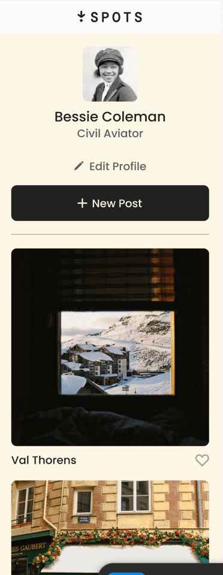

# Project 3: Spots

An image sharing site.

## Description

Spots is an image sharing site that provides you with the oportunity to share cherrished moments through pictures. You are able to customize your profile picture, name, and upload multiple pictures. With Reponsive Design, we have made a smooth transition between different screen sizes for a better user expirence.

### Overview

- Responsive Design
- HTML
- CSS

## Deployment

This webpage is deployed to Github Pages.

- [Deployment Link](https://lu-guzman.github.io/se_project_spots/)

**Figma**

- [Link to the project on Figma](https://www.figma.com/file/BBNm2bC3lj8QQMHlnqRsga/Sprint-3-Project-%E2%80%94-Spots?type=design&node-id=2%3A60&mode=design&t=afgNFybdorZO6cQo-1)

**Images**

**Video Explaining Spots Project**

- [Video Link](https://youtu.be/DTP925V7Ejk)
